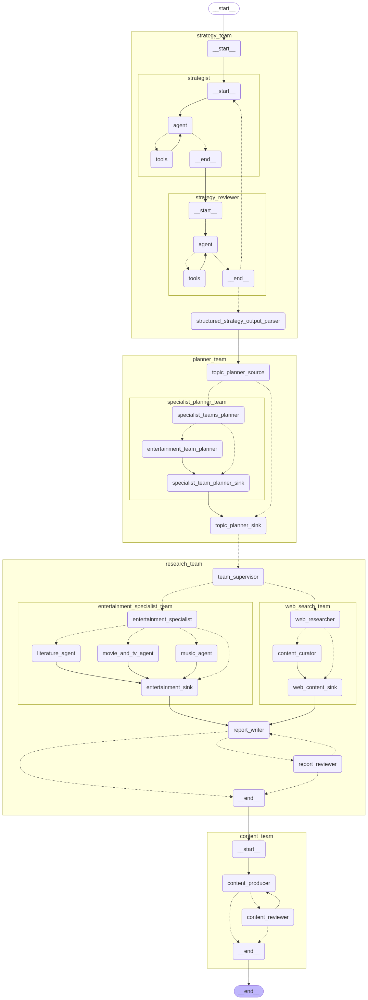

# infogen

Advanced Langgraph agent swarm to do deep research and turn the result into a visually pleasing HTML infographic.
The agent team consists of:
- A strategy team: Turns the user query into a strategy through reflection
- A planner team: Plans the topics to be researched, and the specialists to invoke
- A research team: Coordinators with the subteams to perform the research:
   - Entertainment specialist team: Subagents (literature_agent, movie_and_tv_agent, music_agent) use specialist sources (open movie database, TMDB, MusicBrainz, OpenLibrary) for their research.
   - Web research team: Performs parallel web research using Tavily and handles content curation
- Report writer: Consolidates all results that were gathered in parallel and writes the final report
- Content team: Turns the report into a visually pleasing infographic, writes the HTML/CSS/Javascript code (ShadCN, React), reviews and iterates until done.

.


Folder structure of the repo:
```shell
infogen/
├── infogen/                # Python package/pplication code
│   ├── __init__.py         # Makes `app` a package
│   ├── main.py             # Entry point for FastAPI
│   ├── api/                # API routes
│   │   ├── __init__.py     
│   │   ├── v1/             # Versioned routes
│   │   │   ├── __init__.py
│   │   │   ├── users.py    # Example: user-related routes
│   │   │   ├── items.py    # Example: item-related routes
│   ├── core/               # Core app configuration
│   │   ├── __init__.py
│   │   ├── config.py       # Settings (e.g., env variables)
│   │   ├── security.py     # Security utilities (e.g., auth)
│   ├── db/                 # Database logic
│   │   ├── __init__.py
│   │   ├── models.py       # ORM models (e.g., Pydantic or SQLAlchemy)
│   │   ├── session.py      # Database session setup
│   ├── schemas/            # Pydantic models for request/response validation
│   │   ├── __init__.py
│   ├── services/           # Business logic
│   │   ├── __init__.py
│   ├── tests/              # Unit and integration tests
│       ├── __init__.py
│       ├── test_main.py    # test cases
├── .dockerignore           # Exclude files from Docker builds
├── .gitignore              # Ignore unnecessary files for Git
├── Dockerfile              # Dockerfile for building the container
├── docker-compose.yml      # Docker Compose for local dev (optional)
├── requirements.txt        # Python dependencies
├── README.md               # Project documentation
```
